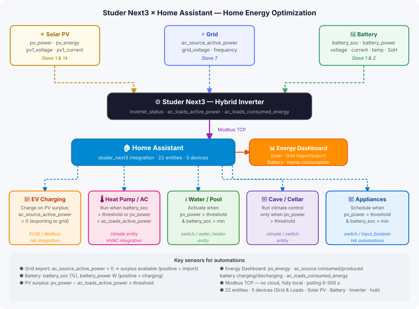

# Studer Next — Home Assistant integration

[](https://github.com/hacs/integration)
[](https://github.com/anakinch75/Studer-Innotec-next3-HA/releases)
[](https://github.com/anakinch75/Studer-Innotec-next3-HA/actions/workflows/tests.yml)
[](https://github.com/anakinch75/Studer-Innotec-next3-HA/actions/workflows/validate.yml)
[](https://github.com/anakinch75/Studer-Innotec-next3-HA/actions/workflows/hassfest.yml)

Custom integration for **Studer Innotec Next3** (three-phase) and **Next1** (single-phase) hybrid inverter/chargers via Modbus TCP.  
No external dependencies — uses a native asyncio Modbus TCP client.

---

## Prerequisites

- Home Assistant **≥ 2024.4** (recommended: latest stable)
- A **Studer Innotec Next3** (three-phase) or **Next1** (single-phase) reachable on your local network via **Modbus TCP** (default port **502**)
- Modbus TCP must be enabled on the device (see the Studer configuration portal)

---

## Installation

1. Open **HACS** in Home Assistant.
2. Search for **Studer Next3** and click **Download**.
3. Restart Home Assistant.

---

## Configuration

1. Go to **Settings → Devices & services → Add integration**.
2. Search for **Studer Next3**.
3. Fill in the form:

| Field | Default | Description |
|---|---|---|
| Model | `Next3 (three-phase)` | Select the inverter model: **Next3** (three-phase) or **Next1** (single-phase) |
| IP address | _(empty)_ | IP address of the inverter on your network |
| Modbus TCP port | `502` | Modbus TCP port (usually 502) |
| Polling interval (s) | `15` | How often data is fetched (5–300 s) |

4. Click **Submit**. The integration tests the connection before saving.

---

## Available sensors

Sensors are organised into **4 sub-devices** under the main hub device, visible in **Settings → Devices & services → Studer Next3** (or **Studer Next1** depending on the model you selected).

### 🔌 Grid & Loads

| Sensor | Unit | Description |
|---|---|---|
| Grid Frequency | Hz | Grid frequency |
| Grid Voltage | V | Line voltage L1-L2 |
| AC-Source Active Power | W | Positive = import, negative = export |
| AC-Source Consumed Energy | kWh | Cumulative energy imported from grid |
| AC-Source Produced Energy | kWh | Cumulative energy exported to grid |
| AC-Loads Active Power | W | Total AC load consumption |
| AC-Loads Consumed Energy | kWh | Cumulative AC load energy |

### ☀️ Solar PV

| Sensor | Unit | Description | Model |
|---|---|---|---|
| PV Power | W | Total PV production (system) | Both |
| PV Energy | kWh | Cumulative solar energy | Both |
| PV1 Voltage | V | DC voltage on PV input 1 (internal MPPT) | Next3 only |
| PV1 Current | A | DC current on PV input 1 (internal MPPT) | Next3 only |

> The Next1 does not have internal MPPT inputs — PV1 Voltage and PV1 Current sensors are not created for Next1 installations.

### 🔋 Battery

| Sensor | Unit | Description |
|---|---|---|
| Battery Power | W | Positive = charging, negative = discharging |
| Battery SOC | % | State of charge |
| Battery Voltage | V | Battery pack voltage |
| Battery Current | A | Positive = charging, negative = discharging |
| Battery Temperature | °C | Battery temperature |
| Battery State of Health | % | Long-term capacity degradation |
| Battery Charging Energy | kWh | Cumulative energy charged |
| Battery Discharging Energy | kWh | Cumulative energy discharged |

### ⚡ Inverter

| Sensor | Unit | Description |
|---|---|---|
| Inverter Status | — | Operating mode (integer code, see note below) |
| Inverter Errors | — | Active error flags (integer bitfield) |

> **Inverter Status codes** are raw integers from the Studer register map. Refer to the [official Studer Modbus documentation](https://technext3.studer-innotec.com/modbus-next) for the meaning of each value. For the Next3 these come from slave 14 (addresses 5100/5102); for the Next1 from slave 29 (addresses 2700/2702).

> **Battery Power sign convention:** the raw Modbus register uses inverter convention (positive = discharging). This integration inverts the sign to match the HA energy dashboard (positive = charging).

> **Battery Power (raw)** is hidden by default. Enable it in **Settings → Devices → Battery** if needed.

---

## Writable settings _(v0.6.0+)_

In addition to sensors, the integration exposes writable entities that let you change Next3 parameters directly from Home Assistant.

> **Note:** writes go to **RAM only** (volatile). Values reset to the inverter's saved configuration on power cycle. For persistent changes, use Studer's own configuration portal.

### 🔋 Battery — Number entities

| Entity | Unit | Range | Register | Slave | Description |
|---|---|---|---|---|---|
| SOC for Backup | % | 0–100 | 346 | 2 | Minimum SOC the inverter keeps as backup reserve |
| SOC for End of Charge | % | 0–100 | 342 | 2 | SOC target at which charging stops |
| SOC for Grid Feeding | % | 0–100 | 344 | 2 | Minimum SOC required before grid injection is allowed |

### 🔌 Grid & Loads — Switch entity

| Entity | Register | Slave | Description |
|---|---|---|---|
| Grid-Feeding Allowed | 1815 | 7 | Enable/disable injection of surplus PV power to the grid |

When **Grid-Feeding Allowed** is OFF and batteries are full, the Next3 will throttle PV production to match local consumption — surplus is curtailed rather than exported.

### Automation example — disable grid feeding at night

```yaml
alias: "Disable grid feeding after sunset"
trigger:
  - platform: sun
    event: sunset
action:
  - action: switch.turn_off
    target:
      entity_id: switch.studer_next3_grid_feeding_allowed
```

---

## Energy dashboard

Go to **Settings → Dashboards → Energy** and configure:

| Dashboard section | Sensor |
|---|---|
| Solar panels | *PV Energy* |
| Grid — from grid | *AC-Source Consumed Energy* |
| Grid — to grid | *AC-Source Produced Energy* |
| Battery — charging | *Battery Charging Energy* |
| Battery — discharging | *Battery Discharging Energy* |
| Home consumption | *AC-Loads Consumed Energy* |

---

## Automation examples



The integration exposes real-time power flow data that makes the following automations possible entirely within Home Assistant — no cloud, no external service.

> **Note on entity IDs:** IDs depend on the name you gave the integration entry during setup. Find exact IDs in **Settings → Entities** and search "studer".

### EV charging on PV surplus

Charge your electric vehicle only when the system is exporting to the grid (i.e. PV production exceeds home consumption):

```yaml
trigger:
  - platform: numeric_state
    entity_id: sensor.studer_next3_ac_source_active_power
    below: -500          # exporting more than 500 W to grid
action:
  - action: switch.turn_on
    target:
      entity_id: switch.wallbox_charge
```

`AC-Source Active Power` is **negative when exporting** (surplus available) and positive when importing. Adjust the threshold to your EV charger's minimum power requirement.

### Heat pump / AC

Run climate systems when battery is charged or PV production exceeds consumption:

```yaml
condition:
  - condition: or
    conditions:
      - condition: numeric_state
        entity_id: sensor.studer_next3_battery_soc
        above: 80
      - condition: template
        value_template: >
          {{ states('sensor.studer_next3_pv_power') | float >
             states('sensor.studer_next3_ac_loads_active_power') | float }}
```

### Other use cases

| Use case | Key sensor | Condition |
|---|---|---|
| Water heater / pool pump | `pv_power` | `> threshold` & `battery_soc > min` |
| Cave / cellar climate | `pv_power` | `> threshold` |
| Smart appliances | `pv_power`, `battery_soc` | Both above thresholds |

> For Modbus register details and Next3 configuration, refer to the [Studer Modbus documentation](https://technext3.studer-innotec.com/modbus-next).

---

## Modbus register mapping

Addresses from the official [Studer next-modbus register map v10.154](https://github.com/studer-innotec/next-modbus).

### Read-only (sensors) — shared by Next1 and Next3

| Sensor | Slave | Address | Type |
|---|---|---|---|
| Grid Frequency | 7 | 0 | float32 |
| Grid Voltage | 7 | 2 | float32 |
| AC-Source Active Power | 7 | 8 | float32 |
| AC-Source Consumed Energy | 7 | 24 | float64 |
| AC-Source Produced Energy | 7 | 36 | float64 |
| AC-Loads Active Power | 1 | 3908 | float32 |
| AC-Loads Consumed Energy | 1 | 3924 | float64 |
| PV Power | 1 | 7505 | float32 |
| PV Energy | 1 | 7519 | float64 |
| Battery Power (raw) | 1 | 8400 | float32 |
| Battery Charging Energy | 1 | 8410 | float64 |
| Battery Discharging Energy | 1 | 8422 | float64 |
| Battery SOC | 1 | 8426 | float32 |
| Battery Voltage | 2 | 318 | float32 |
| Battery Current | 2 | 320 | float32 |
| Battery State of Health | 2 | 326 | float32 |
| Battery Temperature | 2 | 329 | float32 |

### Read-only (sensors) — Next3 only (slave 14)

| Sensor | Slave | Address | Type |
|---|---|---|---|
| Inverter Status | 14 | 5100 | uint16 |
| Inverter Errors | 14 | 5102 | uint16 |
| PV1 Voltage | 14 | 6900 | float32 |
| PV1 Current | 14 | 6902 | float32 |

### Read-only (sensors) — Next1 only (slave 29)

| Sensor | Slave | Address | Type |
|---|---|---|---|
| Inverter Status | 29 | 2700 | uint16 |
| Inverter Errors | 29 | 2702 | uint16 |

### Read/Write (writable settings)

Uses FC16 (Write Multiple Registers). Writes are volatile (RAM only).

| Entity | Slave | Address | Type |
|---|---|---|---|
| SOC for End of Charge | 2 | 342 | float32 |
| SOC for Grid Feeding | 2 | 344 | float32 |
| SOC for Backup | 2 | 346 | float32 |
| Grid-Feeding Allowed | 7 | 1815 | bool |

---

## Troubleshooting

**Cannot connect to device**
- Confirm the Next3 IP is reachable (`ping <ip>` from the HA host).
- Confirm Modbus TCP is enabled on the Next3 and port 502 is not blocked.

**Sensors show `unavailable`**
- The Next3 may have closed the TCP connection. The integration reconnects automatically.
- Check **Settings → System → Logs** and filter by `studer_next3`.

**Sensors on slave 2, 14 (Next3) or 29 (Next1) show `unavailable`**
- These registers (battery device, inverter-specific) may not be accessible depending on your firmware version or system configuration.
- The other sensors (slave 1 and 7) will continue to work normally.

**Energy values reset unexpectedly**
- Energy sensors are `total_increasing`. If the Next3 resets its counters (firmware update, power cycle), HA may show a spike. Use the HA **Statistics** editor to correct long-term stats.

---

## License

MIT
